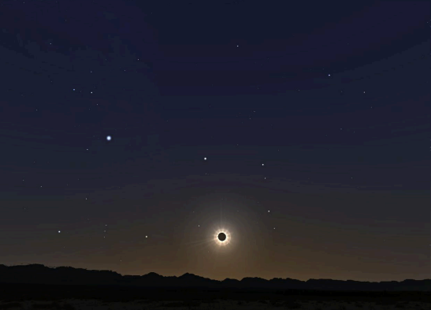

# [TP - Eclipse](https://docs.google.com/document/d/1J32BekPMZvHKM-wrjK0syun31FxDApsf32I5QMv-PY8/edit)



> _El dia del gran eclipse en Argentina, buscamos un buen lugar para verlo._

Contamos con información de los lugares donde se ve el fenomeno natural:
```
        Ciudad 		    (Provincia)    Horario  Altura  Duración
        Arrecifes       (Buenos Aires) 	17:44    2.5º    0m 40s
        Bella Vista     (San Juan) 		17:41    11.5º   2m 27s
        Carmen de Areco (Buenos Aires) 	17:44    2.1º    1m 30s
        Chacabuco       (Buenos Aires) 	17:43    2.6º    2m 07s
        Chepes          (La Rioja) 		17:42    8.9º    2m 03s
        Ezeiza          (Buenos Aires) 	17:44    0.9º    1m 01s
        Jáchal          (San Juan) 		17:41   11.1º    1m 39s
        Pergamino       (Buenos Aires) 	17:44    2.9º    0m 56s
        Quines          (San Luis)  	17:42    7.8º    2m 13s
        Rodeo           (San Juan)		17:41   11.5º    2m 16s
        Río Cuarto      (Cordoba)		17:42    6.3º    1m 54s
        Venado Tuerto   (Santa Fe) 		17:43    4.1º    2m 11s
        Merlo        	(San Luis) 	    17:42    7.1º    2m 19s
```

Además, se conocen los servicios que tiene cada ciudad para observar mejor el eclipse. Por ejemplo:
- En Bella Vista, Chepes y Ezeiza hay telescopio.
- En Chacabuco, Arrecifes, Chepes y Venado Tuerto hay reposeras públicas.
- Observatorio astronómico hay en Quines.
- Lentes para sol se consiguen en Quines, Rodeo, Rio Cuarto, Merlo.

## Se quiere obtener
1. Los lugares donde la altura del sol es más de 10º o empieza después de las 17:42.
2. Los lugares que no tienen ningún servicio.
3. Las provincias que tienen un sola ciudad donde verlo.
4. El lugar donde dura más.
5. La duración promedio del eclipse:
    - en todo el pais
    - en cada provincia
    - en las ciudades con telescopio
6. Analizar la inversibilidad de los predicados del item 2 y 5. Justificar.

