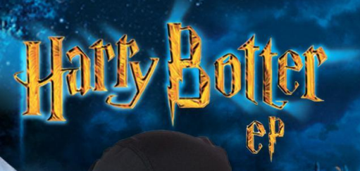
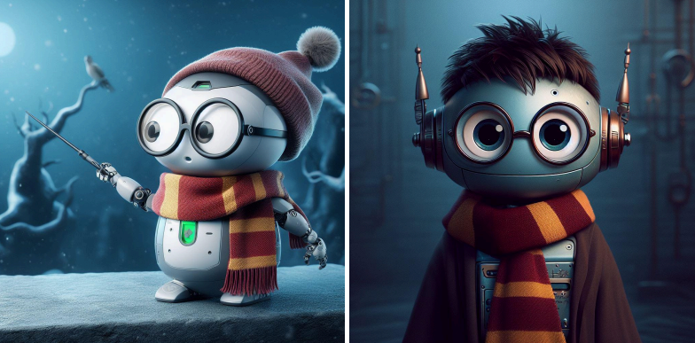

# [Parcial Objetos - Harry Botter](https://docs.google.com/document/d/11WK_claDCYLsUZlus1pvjNMx1_CdVGI-WO-_4kPO0HI/edit)

**Queremos modelar el universo de Harry Botter, un joven robot de habilidades que parecen mágicas, que asiste a la Escuela Hogwart de robótica y hechicería, donde encuentra compañeros, profesores y todo tipo de criaturas bóticas.**

En el universo existen muchos individuos, bots, de quienes se conoce la carga eléctrica y si tiene aceite puro o aceite sucio. Todos pueden sufrir las consecuencias de los hechizos, pero no todos pueden lanzarlos.
Hay ciertos elementos, aparentemente inertes pero que en realidad son bots, como las escobas, las varitas, la snitch del quidditch, el sombrero seleccionador y otros. Los personajes más interesantes son los bots estudiantes.
Cada estudiante pertenece a una casa dentro de Hogwart, que puede ser Gryffindor, Slytherin, Ravenclaw y Hufflepuff. Al ingresar a la escuela, sombrero bot seleccionador determina a qué casa pertenece cada estudiante. El sombrero asigna cíclicamente un estudiante a una casa distinta, para que queden distribuidos parejos.
La casa Gryffindor no es peligrosa, Slytherin sí. Ravenclaw y Hufflepuff, son peligrosas cuando tienen más integrantes de aceite sucio que puro.

Una de las actividades de los estudiantes en Hogwart es asistir a materias donde se aprenden hechizos. Los hechizos son lanzados por alguien (un estudiante o profesor) e impactan sobre cualquier bot. Para poder lanzar un hechizo, el individuo debe primero haberlo aprendido, estar activo y tener las condiciones que el hechizo requiere. El individuo hechizado sufre las consecuencias propias del hechizo, pero eventualmente puede contar con alguna protección que atenúe dichos efectos.

Los hechizos que existen son:
- inmobilus: Le disminuye la carga eléctrica en 50 unidades y no hay requisitos adicionales para lanzarlo
- sectum sempra: En caso que tenga aceite puro, lo deja sucio. Es necesario ser experimentado para lanzarlo.
- avadakedabra: anula totalmente la carga eléctrica, solo lo puede lanzar quien tiene aceite sucio o pertenece a una casa peligrosa.
- Hay muchos otros hechizos comunes, que disminuyen la carga eléctrica en una cantidad determinada, y tiene como requisito adicional tener mayor carga eléctrica que la que disminuira al hechizado.
- Inventar un nuevo hechizo.

Cuando un bot queda con carga eléctrica 0 se considera inactivo.
Un estudiante es experimentado cuando sabe más de 3 hechizos y tiene carga eléctrica mayor a 50. Un profesor, para considerarse experimentado, requiere además haber dictado 2 o más materias.

Los profesores tambien pertenecen a un casa. Tienen la ventaja de poder defenderse de los efectos de los hechizos: Cualquier intento de disminuir su carga electrica es inofensivo. Pero en caso que de que se le intente anularla totalmente, queda en la mitad.
El sombrero bot seleccionador es inmune a los intentos de cambiarle el aceite.
Los estudiantes no se pueden convertir en profesores, ni pueden admitirse como estudiantes otros bots.

## Se pide:
1. Llega un grupo de estudiante a Hogwart y el sombrero bot los distribuye en las casas correspondientes.
2. Crear una materia, determinando qué profesor la dicta y el hechizo que se enseñará.
3. Hacer que un grupo de estudiantes asista a una materia y aprenda el
correspondiente hechizo.
4. Hacer que un estudiante lance un hechizo a otro individuo, en caso que pueda hacerlo.
5. Que todos los integrantes de una determinada casa le lancen el último hechizo que dispone cada uno a un bot maligno cuyo nombre nadie pronuncia.
Realizar el código correspondiente y hacer algunas pruebas 

## Ejemplos:
La materia "defensa contra los hackeos oscuros", dictada por el profesor "Severus" enseña a todo estudiante que asiste el hechizo "inmobilus".

Harry Botter, Draco Malfoy, boty, chatGPT y Hermione Granger ingresan como estudiantes a Hogwart, el sombrero seleccionador envia a Harry a Gryffindor, a Draco a Slitherin, a los otros dos bots a las siguientes casas, y a Hermione le corresponde nuevamente Gryffindor.

Harry, con carga electrica 80, apenas ingresa a Hogwart no puede lanzar ningun hechizo.
Luego asiste a cuatro clases, entre ellas una en la que aprende el "sectum sempra". Intenta lanzarle dicho hechizo a Draco y lo logra. Draco, que era aceite puro, queda con aceite sucio. Mas tarde, Harry le lanza el hechizo al sombrero seleccionador, logra lanzarlo, pero al sombrero, aún siendo aceite puro, no le sucede nada.

El estudiante Draco, con aceite puro, de la casa slytherin, que sabe muchos hechizos, se enfrenta a Albus, un profesor que ademas de conocer muchos hechizos también dicto varias materias, de gryffindor, con aceite puro. Los dos tienen carga electrica 100.
Primero, Albus le lanza exitaosamente el ultimo hechizo que adquirió, que es un hechizo común de carga electrica 60, dejando a Draco con carga 40. Luego, Draco le hace el hechizo avadakedabra, el cual conoce, y Albus queda con carga electrica 50. Por último, Albus intenta repetir el hechizo anterior, pero ya no se encuentra en condiciones de lanzarlo y no sucede nada.

